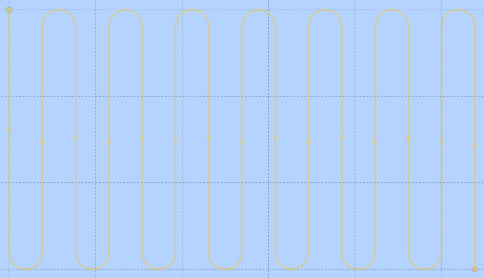
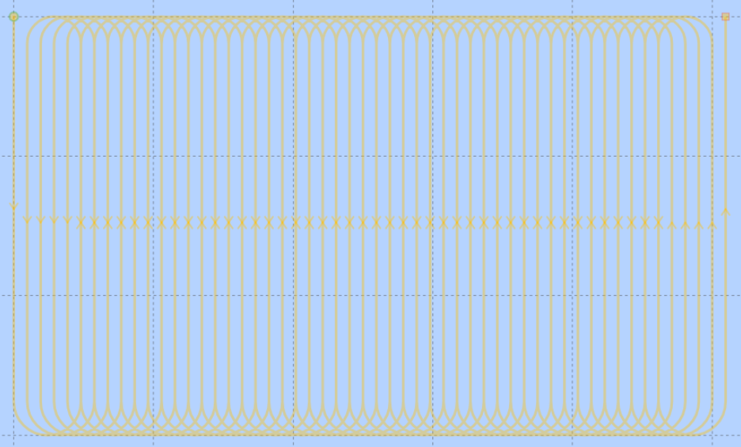

# Mission Planner Package

## Description

This package handles the creation of paths and start of PF missions along a zone of interest. Through a service, this area is defined by northing and easting limits, inside which a new path is created.

This path can be a **normal** lawnmower or an **encircling** lawnmower, both fully customisable through the *config_mission_planner.yaml* file or through a service.

## Nodes
* [mission_planner](mission_planner.md)