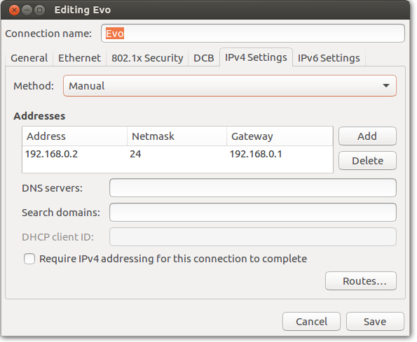
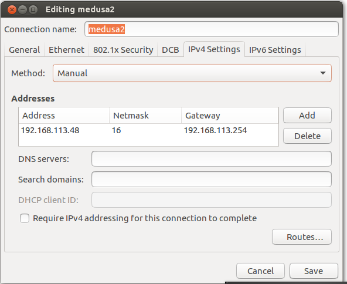
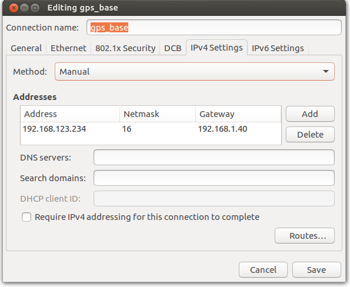

```

Tinkers: DSOR Group
         malaclemys  -> jquintas@gmail.com

Descripton: Network interfaces of glider_stack and DSOR vehicles
Date: 20200226

@~~~~~~~~~~~~~~~~~~~~~~~~~~~~~~~~~~~~~~~~~~~~~~~~~~~~~~~~~@
@         ?                                               @
@          __                                             @
@      ____||_                  ___                       @
@     (_______)            ,,  // \\                      @  
@      ____||_            (_,\/ \_/ \                     @
@     (_______)             \ \_/_\_/>                    @
@                            /_/  /_/         ______      @
@                                            |START |     @
@                                            |______|     @
@                                            |            @
@____________________________________________|____________@
```

# Configure Network interfaces in vehicle

This is done by running the following commands at the terminal:

```
name=$HOSTNAME
sudo rm -f /etc/network/interfaces
sudo ln -s "${CATKIN_ROOT}/catkin_ws/src/glider_vx glider_scripts/system_configurations/newtork_interfaces/${name}_interfaces" /etc/network/interfaces
```

 The previous commands are present *@${CATKIN_ROOT}/catkin_ws/src/glider_vx/glider_scripts/tinker_tools/installation_scripts/config_glider_os.sh*. You should run this while configuring a new machine for a vehicle.

# Network interfaces for vehicles pcs

| File | Vehicle |  Static IP |
|:----------:|:----------|:----:|
| **delfim_interfacez** |  Delfim Catamaran  | 192.168.1.30 |
| **mblack_interfaces** | glider black| 192.168.1.32
| **mds_lower_interfaces**| glider Deep Sea lower pc | 192.168.1.10
| **mds_upper_interfaces**| glider Deep Sea upper pc | 192.168.1.20
| **mred_interfaces**| glider red  | 192.168.1.31 |
| **myellow_interfaces**| glider yellow  | 192.168.1.33 |

This configurations are for **PC104** and **epic board**. In the future if we change pcs, probably we won't have two eth ports, so we will have to configure just one port.

# Network interfaces for own pcs and lab pcs

In network connections add the following Ethernet connections:

## glider config network remote machine


## EVO modems config network remote machine



## glider bullets config network remote machine



## gps base station config network remote machine




# Internet Access on glider Host Machines

```
roscd glider_scripts/tinker_tools/internet_scripts && bash glider_enable_internet.sh
```