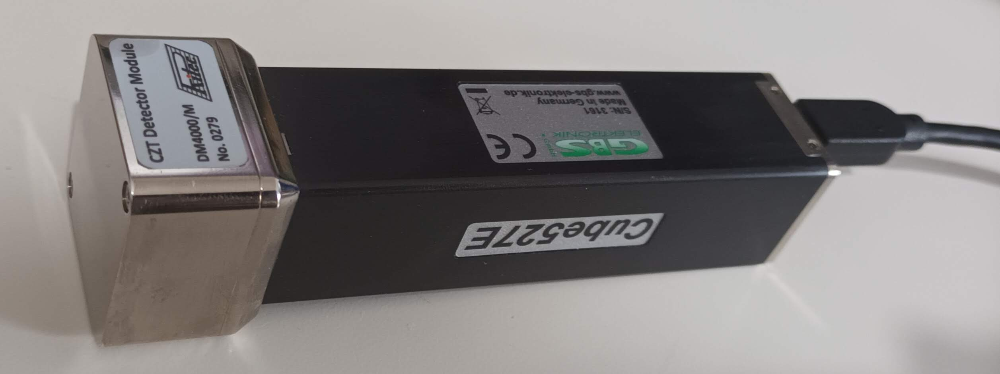

# MCA_COMM library

[Cube527E Documentation](doc/Documentation.md)

[Setup Raspberry Pi 4](doc/setup-rpi4.md)

[Install ROS Noetic](doc/install-ros.md)

## Install FTD2XX library

The MCA_COMM library depends on the FTD2XX proprietary library.

Download the appropriate version for your system architecture from [here](https://ftdichip.com/drivers/d2xx-drivers/):
* [ARMv8 hard-float](https://ftdichip.com/wp-content/uploads/2022/07/libftd2xx-arm-v8-1.4.27.tgz)
* [x64](https://ftdichip.com/wp-content/uploads/2022/07/libftd2xx-x86_64-1.4.27.tgz)

The Raspberry Pi 4 has an ARMv8 hard-float architecture.

Download and install the FTD2XX library following the instructions [here](https://www.ftdichip.com/Drivers/D2XX/Linux/ReadMe.txt).
These are the instructions for the ARMv8 hard-float architecture:
```bash
wget https://ftdichip.com/wp-content/uploads/2022/07/libftd2xx-arm-v8-1.4.27.tgz
tar -xzvf libftd2xx-arm-v8-1.4.27.tgz
cd release/build
sudo -s 
cp libftd2xx.* /usr/local/lib
chmod 0755 /usr/local/lib/libftd2xx.so.*
ln -sf /usr/local/lib/libftd2xx.so.* /usr/local/lib/libftd2xx.so
cd ..
cp ftd2xx.h  /usr/local/include
cp WinTypes.h  /usr/local/include
ldconfig -v
exit
cd ../..
rm -rf libftd2xx-*.tgz release
```

## Setup workspace

Create a workspace and checkout the repositories with the code:
```bash
mkdir -p ~/mca_comm_ws/src
cd ~/mca_comm_ws/src
git clone git@github.com:ramones-eu/mca_comm.git
```

Install `catkin_tools` following the instructions [here](https://catkin-tools.readthedocs.io/en/latest/installing.html):
```bash
sudo apt install -y python3-catkin-tools
```

Install a C++ compiler, either `g++` or `clang`:
```bash
sudo apt install -y g++
```

## Build workspace

```bash
cd ~/mca_comm_ws
catkin build
```

## Deploy udev rules

Deploy the following `udev` rule in order to unbind the MCA Cube527E device from `ftdi_sio` kernel module (that also runs `usbserial`) and run it in user space without `sudo`:
```bash
sudo cp udev/99-mca-cube527e.rules /etc/udev/rules.d
sudo udevadm control --reload-rules
```

## Test device out

Connect the gSniffer sensor over USB and test it out with the command line tool:
```bash
devel/lib/mca_comm/mca_cmd
```

We should be able to set the high voltage to 0V and wait for it to reach that value.
```bash
$ devel/lib/mca_comm/mca_cmd
Connecting to MCA...
Connected with MCA 3161, baud rate: 3000000
> query_power
High Voltage: 1536   State: 0
High Voltage at stop: 0
> set_hv 0
High voltage set to 0
> query_power
High Voltage: 1411   State: 0
High Voltage at stop: 0
> query_power
High Voltage: 787   State: 0
High Voltage at stop: 0
>
```

:information_source: There's no need to set the high voltage to 0V and wait for it to reach 0V before unplugging the device. As far as the **CZT Detector Module** (silver part) and the **Cube527E** (black part) aren't detached or attached, it's safe to unplug the device regardless of the high voltage.



## Shutdown service

:information_source: As mentioned before, there's no need to set the high voltage to 0V and wait for it to reach 0V before unplugging the device. However, if you still want to ensure that, you can use the following `systemd` shutdown service.

Copy the `systemd` shutdown service and enable it:
```bash
cd ~/mca_comm_ws
sudo cp src/mca_comm/systemd/mca-shutdown.service /etc/systemd/system/
sudo systemctl daemon-reload
sudo systemctl enable mca-shutdown.service
```

:warning: The service relies on the `mca_shutdown` executable being in `/home/ubuntu/gsniffer_ws/devel/lib/mca_comm/mca_shutdown`, which should be there if the workspace has been built.

:warning: The `mca_shutdown` executable doesn't implement any retry logic if the device is busy or being used by another process, like a ROS node. That could be implemented if needed, but since there's no need to bring the **High Voltage** down to `0V` and reach that value before unplugging the device, that wasn't implemented.

You can verify the `systemd` service is working with `sudo reboot` or `sudo shutdown -h now`. If you have a monitor connected to the computer, you should see this after `~30s`:
```bash
[***   ] A start job is running for gSniffer shutdown to ensure high voltage is zero (4min 14s / no limit)
```

:information_source: If you want to see the `mca_shutdown` output, which shows the current **High Voltage**, so you can see how it's going down and reaches `0V`, you can modify the service to uncomment the `StandardOutput=journal+console` line:
```bash
sudo vim /etc/systemd/system/mca-shutdown.service
sudo systemctl daemon-reload
```

Finally, since we don't really need this shutdown service, we can disable it with:
```bash
sudo systemctl disable mca-shutdown.service
```
